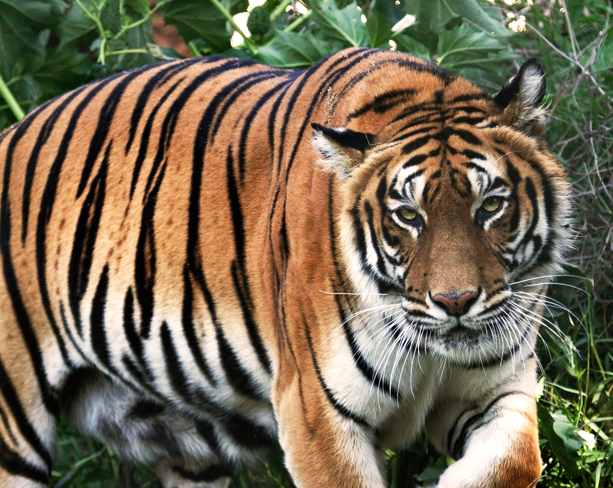

# Cartoonify Me

## Project Description


This is a Python project that utilizes image processing techniques to transform photos into cartoons by using a keyword. The project leverages ONNX (Open Neural Network Exchange), OpenCV, PIL (Python Imaging Library), and other tools for image manipulation and transformation. The goal is to enable users to create cartoonized versions of their images in an automated and efficient manner.

## Technologies Used

- **Python** : The primary programming language.
- **ONNX** : Used to load and run machine learning models
- **OpenCV** : Used for image processing and manipulation.
- **PIL** : Used to read, write, and manipulate image data.
- **rembg** : Used for removing the background of images.


```bash
git clone https://github.com/votre_username/cartoonifyme.git
cd cartoonifyme
pip install -r requirements.txt
```

## Usage

1. To transform an image simply and remove the background:
    ```bash
   python thread_img.py --image_name tiger
    ```

## Screenshots
Here are some examples before and after the image transformation:

### Before 





### After


